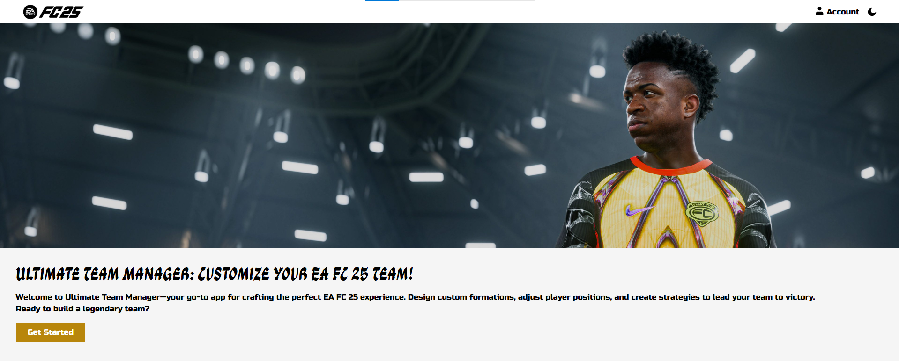

# Brief 6 | FC25 Ulitmate Team
### Contexte de Projet
Application Web de gestion d'équipe Ultimate Team pour EA FC 25, permettant aux utilisateurs de créer, personnaliser et gérer leurs formations tactiques et leurs équipes de joueurs via une interface interactive et réactive.

### Liens exterieurs
- [**Live Demo.**](https://ayoub-ahnaou.github.io/FC25-ulitmate-team/src/)
- [**Presentation Canva.**](https://www.canva.com/design/DAGX4CjnIHc/RqrSussTS7iQVNRNyLNkcQ/edit?utm_content=DAGX4CjnIHc&utm_campaign=designshare&utm_medium=link2&utm_source=sharebutton)
- [**Planification de projet.**](https://github.com/users/ayoub-ahnaou/projects/7)

### Fonctionnalités Principale
- **Création et Gestion des Joueurs**: L'utilisateur peut ajouter un nouveau joueur personnalisé avec des statistiques dynamiques basées sur la position choisie.

- **Positionnement des Joueurs**: L'utilisateur peut positionner ses joueurs selon le plan (4-3-3) en respectant la position de chaque joueur dans l'équipe ou dans les joueurs de changement.

- **Validation des Champs**: Avec une vérification stricte, l'utilisateur ne peut pas ajouter de joueurs avec des caractères spéciaux dans le nom, ou avec des statistiques supérieures à 100 ou avec des valeurs vides en général.

- **Responsive Design**: Offre une réactivité globale pour tous les appareils, qu'il s'agisse d'ordinateurs portables, de tablettes ou de téléphones mobiles.

### Technologies et Outils utilisées
- **HTML**
- **Framwork TailwindCSS**
- **JavaScript vanila**
- **Git, GitHub et GitHub Pages**
